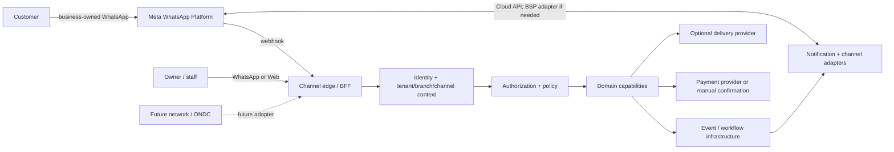

# Architecture

## Status and evidence discipline

This document separates:

- **HLD** — system context, capability ownership, trust boundaries and deployment posture.
- **LLD** — contracts, state transitions, event envelopes, idempotency and concrete flow behavior.

Logical capability boundaries are not a commitment to one deployed service per capability. A boundary becomes a deployment boundary only when a meaningful ownership, data, security, scaling or lifecycle reason exists.

Raw-founder citations use the form `Raw T<number> (message-id)`. The turn
number is a stable, derived chronological index over substantive
`user`/`assistant` text messages in `nekurama.raw.chat.json`, ordered by
`create_time` and then mapping-node ID. For an exact source anchor, use
`nekurama.raw.chat.json#conversation_id=6aa2f947-fce0-83e8-99d0-9a52ab2b15cd;mapping/message=<message-id>`.
Assistant turns are included as recorded decision history; founder-authored
turns remain the primary evidence for product intent.

The current decision log is `nekurama/Bulb#1` (especially §§8-22, §§24-25,
§29 and §31). `historical ManojVysyaraju/bulb#1` remains preserved historical
evidence rather than an independently current decision source.

### Decision-status vocabulary

- **Confirmed** — directly supported by founder intent or an explicit domain invariant; implementation details may still be open.
- **Proposed** — an architecture hypothesis or candidate shape useful for design work; it is not a commitment.
- **Unresolved** — the evidence establishes a requirement or question but does not select an implementation, provider or topology.
- **Non-goal** — explicitly outside the current MVP or architecture handoff.

This document uses those labels to avoid turning research discussion, assistant recommendations or candidate deployment shapes into decisions.

### Key HLD/LLD decision citation index

The following index is the review handoff for the decisions most likely to be
mistaken for implementation commitments. Each row names exact raw mapping
message UUIDs and the current repository documents that must be read with the
raw evidence.

| Decision area | Raw mapping/message UUIDs | Current repository sources |
|---|---|---|
| Restaurant-owned channel and BABAI operating behind it | Raw T33 `ded20a72-7392-4785-8983-b6e7d75eae3b`; Raw T37 `eadec8d3-a035-43e3-814a-6d3312001bbf`; Raw T47 `1df966d4-0c16-4a9a-b8cb-4375e5c2fda7`; Raw T48 `bbb21b07-0508-4dde-94f1-60e9982ec3e8` | `product-definition.md`; `experience-and-channels.md` |
| Tenant, branch, channel and customer relationship boundaries | Raw T34 `bbb21cdc-296c-4806-af69-c1b7f40c4cf8`; Raw T99 `bbb21fb5-8f72-4a7f-b42b-333101d4a900`; Raw T149 `bbb2129e-e9fa-43bf-adca-b0bc7a956664` | `domain-model.md`; `product-definition.md` |
| Coarse capability boundaries without one-service-per-capability deployment | Raw T153 `bbb21941-90d7-47d8-b4e0-671c6caecb09`; Raw T154 `1764f643-59fd-4cf5-be14-6aee32fc973a`; Raw T157 `bbb21f46-ddff-464d-bb6c-8a47d4188b9a` | `architecture.md`; `domain-model.md` |
| General state/transition and workflow capability; implementation unresolved | Raw T115 `bbb210cc-a1ef-4ea9-b1a7-7c52f0011721`; Raw T117 `bbb216ed-0269-4c6c-8e28-f17031c1fa93`; Raw T119 `bbb211c0-c142-4837-aca7-b67a21454ec8`; Raw T122 `0011555d-10c7-4dbc-aca8-2bf7c55d324b`; Raw T136 `09c90c51-c4ae-40a6-9bd8-aea16eaf3339` | `architecture.md`; `domain-model.md` |
| Versioned, correlated, flow-scoped events and reliable delivery | Raw T125 `bbb21b98-7460-45d5-a616-418ffbf47484`; Raw T137 `bbb21f78-6e9b-4ef8-9a07-60fe2273e772`; Raw T139 `bbb213b8-d58c-403e-b858-bdaa1ac750b8`; Raw T264 `bbb21a7f-4d44-4cc1-8f60-1172bdcc303c`; Raw T268 `bbb21426-5f7e-4c38-82e4-e288b9aae01c` | `architecture.md`; `domain-model.md` |
| Zero-trust, scoped authorization and sensitive-data controls | Raw T139 `bbb213b8-d58c-403e-b858-bdaa1ac750b8`; Raw T144 `548da5a7-b8c7-4fd8-b129-04c2115c9134`; Raw T149 `bbb2129e-e9fa-43bf-adca-b0bc7a956664` | `architecture.md`; `domain-model.md` |
| Direct business payment and staff-owned commercial corrections | Raw T72 `bbb21c29-06e2-44d7-bd05-c2f9c28c3f4f`; Raw T209 `bbb21545-4598-4ecd-a1fa-af977810bd5b`; Raw T216 `bbb216f2-0ccd-4871-a670-e02f94100750`; Raw T218 `bbb21ee2-2265-4c8a-ba89-82249c36e181` | `product-definition.md`; `domain-model.md` |
| AI assistance without authority over controlled state | Raw T410 `bbb21914-7687-4f6e-848a-30e1e7e850f8`; Raw T414 `bbb21eb2-e878-4ef3-a499-f81e1cdc2d83`; Raw T434 `bbb21a5b-1600-43f4-b2db-6456579c3a2f` | `product-definition.md`; `domain-model.md` |

## Current architectural answer

BABAI is a business operating platform built around WhatsApp. Its first validated workflow is restaurant-first: a business-owned channel receives customer conversations, turns structured intent into a cart and order, and coordinates payment, staff operations and pickup-first fulfillment. Web remains the dense configuration and operations surface; WhatsApp remains the immediate conversational/action surface. This matches the product definition and the founder's formulation of BABAI as a platform for customer and operational workflows, not a marketplace or generic chatbot. [Raw T410 `bbb21914-7687-4f6e-848a-30e1e7e850f8`; Raw T414 `bbb21eb2-e878-4ef3-a499-f81e1cdc2d83`; `nekurama.chatgpt.md`; `product-definition.md`]

The architecture therefore has:

1. **A channel edge** that receives and sends messages through provider adapters.
2. **Tenant and context resolution** that maps a destination channel to the business, branch context and customer relationship.
3. **Coarse-grained domain capabilities** that own authoritative state.
4. **Policy, identity and workflow controls** around every state-changing command.
5. **Durable event, audit, reconciliation and telemetry infrastructure** that coordinates side effects without replacing domain state.

### System context (HLD)



The customer normally messages the restaurant's number, not a BABAI directory number. The receiving phone number identifies the connected channel and therefore the tenant; a multi-branch business using one number may still require an explicit branch choice. [Raw T33 `ded20a72-7392-4785-8983-b6e7d75eae3b`; Raw T34 `bbb21cdc-296c-4806-af69-c1b7f40c4cf8`; `domain-model.md`]

## Bounded capabilities and ownership (HLD)

These are conceptual ownership boundaries. They may initially be colocated in one application or a small number of deployables.

| Capability | Owns authoritative state | Does not own |
|---|---|---|
| **Identity and membership** | Global identities, credentials/identity resolution, memberships and role assignments | Tenant business state or order state |
| **Authorization and policy** | Scoped capability decisions, preconditions and policy evaluation | The aggregate state being protected |
| **Tenant / branch / channel** | Billing-account relationship, tenant/business, branch, connected channel, operational configuration and channel lifecycle | Provider transport semantics or customer global identity |
| **Catalog / menu / availability** | Menu structure, immutable revisions, publication and availability | Historical order truth |
| **Conversation / messaging context** | Conversations, messages, automation/human-takeover state and interaction context | Payment, order or fulfillment authority |
| **Cart and ordering** | Cart, order lifecycle, order commands and immutable commercial/order snapshots | Payment settlement or delivery execution |
| **Commercial calculation** | Price, promotion and tax/GST evaluations and their attributable results | The committed order lifecycle; the order freezes the evaluated result |
| **Payment** | Payment intent/state, provider callbacks, reconciliation and refund records | BABAI subscription billing; order acceptance |
| **Fulfillment / delivery / tracking** | Fulfillment lifecycle and optional provider interaction | The order aggregate or payment custody |
| **Billing and entitlements** | BABAI subscription, plan, invoice and feature entitlement | Customer-to-business order payment |
| **Notification / channel integration** | Provider adapters, templates, outbound delivery status and retry behavior | Intent interpretation or domain state transitions |
| **Workflow / reconciliation** | Timers, long-running orchestration, retries, replay and mismatch detection | Authoritative business state |
| **Audit / observability** | Immutable security/business history and telemetry | The source of truth for current domain state |

The domain model's aggregate map remains the authority for transactional ownership: `Tenant`, `Branch`, `Channel`, `TenantCustomer`, `Menu`, `Conversation`, `Cart`, `Order`, `Payment` and `Fulfillment`, with `Promotion` likely a tenant-owned configuration aggregate. Engines/capabilities may span aggregates and are not automatically aggregate roots. [`domain-model.md`]

### Ownership rules

- A capability owns its state and exposes commands/queries/contracts; other capabilities do not read its database directly.
- Cross-capability references use stable IDs and explicit contracts, not embedded authoritative copies.
- Domain state and validated transitions are authoritative. Events coordinate side effects; audit records history; workflow executes processes; telemetry observes.
- `Order` freezes the evaluated commercial result and the relevant menu revision. Later menu, price, promotion or tax changes do not rewrite historical order truth.
- `Payment` and `Fulfillment` are independent state machines. Payment completion does not imply order acceptance.
- Human takeover pauses conversational automation only; order, payment and fulfillment processing continue independently.

## MVP deployment posture versus conceptual boundaries

### MVP deployment (deliberately partial)

The MVP should use a **small number of deployables**, selected after the pilot exposes actual security, data, scaling and operational needs. A reasonable starting shape is:

1. **Channel edge / BFF** for web, WhatsApp webhooks and outbound-provider calls.
2. **Core domain runtime** containing the first cohesive tenant, catalog, conversation, cart/order and payment/fulfillment capabilities.
3. **Durable worker/runtime** for menu ingestion, outbound delivery, retries, timers and reconciliation.
4. **External integration adapters** for Meta/WhatsApp, payment and optional delivery providers.
5. **Audit/observability facilities** with access controlled separately from business state.

These can be fewer or more deployables without changing the conceptual boundaries. Do not select Kubernetes, a cloud, a broker, a database, a workflow product, or a one-microservice-per-capability topology from this document. The founder expressed a preference for microservices, but the durable rule is coarse-grained separation by capability, security, data ownership and lifecycle—not decomposition by noun. [Raw T153 `bbb21941-90d7-47d8-b4e0-671c6caecb09`; Raw T154 `1764f643-59fd-4cf5-be14-6aee32fc973a`; `domain-model.md`]

### LLD boundary

The first implementation should make these contracts explicit even when code is colocated:

- inbound channel message/webhook contract;
- context-resolution and authorization command contract;
- aggregate command and validated-transition contract;
- event envelope and schema registry;
- provider adapter contract;
- idempotency, retry and reconciliation contract;
- audit and sensitive-data access contract.

Exact REST/gRPC/GraphQL choice, serialization, broker, database and workflow engine remain unknown. The raw discussion explored gRPC/Protobuf and asynchronous flows, but did not establish a production protocol decision. [Raw T163 `bbb2111f-375d-4b57-b543-441369f304ec`; Raw T185 `bbb211a0-56e1-4951-bb51-9ee3f587f7d8`; Raw T195 `bbb21fcf-8976-43bb-a749-8a7ae584a904`; Raw T200 `1aaa80e7-2767-49ae-8054-8d0fb81f4fc0`]

## State engine and workflow posture (HLD/LLD)

**Confirmed requirement:** BABAI needs a state/transition capability for business flows, not only for payment processing. The founder explicitly broadened the requirement to a general state engine and then listed idempotency, transactions, retries, timers, human waits/interventions, audit history and recovery as functional needs. [Raw T115 `bbb210cc-a1ef-4ea9-b1a7-7c52f0011721`; Raw T117 `bbb216ed-0269-4c6c-8e28-f17031c1fa93`; Raw T119 `bbb211c0-c142-4837-aca7-b67a21454ec8`]

The HLD boundary is therefore the separation between:

- authoritative domain state and validated transitions owned by the relevant aggregate/capability; and
- durable workflow execution that coordinates timers, retries, asynchronous work, human intervention and recovery around that state.

The LLD must define state schemas, transition commands, preconditions, transition authorization, event effects, idempotency, timeout/timer behavior, human-wait behavior, retry/compensation behavior, audit history and recovery/replay semantics. These requirements apply to ordering, payment, fulfillment, conversation, onboarding and other long-running flows as they become material.

The following remain **unresolved**:

- whether state handling is one generic framework, flow-specific state machines, or a constrained combination;
- whether workflow execution is custom, open source or a managed platform;
- whether a durable workflow product such as Temporal is suitable; it is explicitly not selected during research;
- where workflow records, event history, timers and recovery metadata are stored;
- the exact boundary between domain transitions, workflow orchestration and integration retry logic;
- the sync/async contract and operational ownership for each flow.

The founder's research-stage position was to define the State Engine contract and compare alternatives before choosing an implementation; it did not authorize locking Temporal or another product. [Raw T122 `0011555d-10c7-4dbc-aca8-2bf7c55d324b`; Raw T136 `09c90c51-c4ae-40a6-9bd8-aea16eaf3339`; this document's open questions]

## Data, events and reliability (LLD)

### Command and state transition pattern

```text
Inbound message / UI action
  -> authenticate and verify provider context
  -> resolve identity, tenant, branch, channel and session
  -> authorize command and evaluate policy/preconditions
  -> load the owning aggregate
  -> validate an explicit state transition
  -> persist authoritative state and an outbox record atomically
  -> publish/dispatch the event
  -> run idempotent consumers, notifications, workflow and reconciliation
```

Customer interactions may be synchronous, asynchronous or hybrid by use case: status reads can be synchronous; placing an order needs a bounded command response plus asynchronous side effects; payment confirmation, notifications and delivery are event-driven where appropriate. The exact matrix is a design-phase artifact, not a global “everything async” rule. [Raw T165 `bbb21849-7c34-4782-a440-5be8c75acb62`; Raw T201 `bbb21dde-e359-4e19-b211-634eb6b5d917`; Raw T202 `293ad099-4f4c-4e6c-a554-42d55cc8677b`]

### Event rules

The founder's durable event requirements are:

- every event has a unique event identity and a versioned type/schema;
- related events carry correlation and causation context, with session/flow context where applicable;
- event type is derived by the trusted edge/domain context, not accepted blindly from a client;
- events are flow-scoped and must not authorize unrelated flows;
- event contracts are explicit and versioned; an old version must be handled deliberately, not as an opaque server failure;
- event transport is not the authoritative domain database.

The exact event code registry (for example, whether human-readable names also receive numeric families), envelope fields, retention and query store remain open. [Raw T125 `bbb21b98-7460-45d5-a616-418ffbf47484`; Raw T129 `bbb21da2-975e-4aaa-b1a4-05542d023114`; Raw T137 `bbb21f78-6e9b-4ef8-9a07-60fe2273e772`; Raw T139 `bbb213b8-d58c-403e-b858-bdaa1ac750b8`; Raw T268 `bbb21426-5f7e-4c38-82e4-e288b9aae01c`]

A minimum event envelope should be designed to carry, subject to data classification:

```text
eventId
eventType
schemaVersion
occurredAt / recordedAt
producer
tenantId / branchId where applicable
actor or subject reference
aggregateType / aggregateId
correlationId
causationId
sessionId / flowId where applicable
idempotencyKey
classification
payload reference or typed payload
```

### Delivery guarantees and failure handling

Use at-least-once delivery with:

- transactional outbox at the authoritative writer;
- inbox/deduplication at consumers;
- idempotent commands and provider callbacks;
- bounded retries with backoff;
- a dead-letter/quarantine path that distinguishes retryable, non-retryable and human-action cases;
- replay only under explicit authorization and version rules;
- reconciliation against Meta, payment and delivery providers;
- alerts to the correct platform, tenant, staff or customer actor.

The system must not silently convert a failed event or provider callback into success-shaped state. The exact broker and workflow implementation are unknown. [Raw T125 `bbb21b98-7460-45d5-a616-418ffbf47484`; Raw T126 `e472fe3d-22d5-4595-aafd-986683b13a3c`; Raw T264 `bbb21a7f-4d44-4cc1-8f60-1172bdcc303c`; `domain-model.md`]

## Thin/placeholder artifact inventory

Before this handoff, `docs/products/babai/architecture.md` was the only
architecture-specific thin artifact: it contained a short current answer and a
question list, but no ownership map, HLD/LLD boundary, integration seams,
data/reliability contract or source anchors. This file now fills that gap
without turning design-stage hypotheses into confirmed deployment decisions.

The adjacent files are substantive partial inputs, not architecture
placeholders:

- `domain-model.md` owns aggregate, invariant and commercial-engine decisions.
- `product-definition.md` owns the MVP/product boundary and pilot constraints.
- `experience-and-channels.md` owns channel and human-takeover experience.
- `docs/README.md` owns knowledge-base mining/status rules rather than system
  architecture.

## Explicit open questions

These questions remain intentionally unresolved; the architecture must not
infer answers from the candidate boundaries above:

- Final MVP deployment topology, packaging, environment model and capability
  extraction sequence.
- Physical data stores, transaction boundaries, tenancy partitioning,
  migrations, retention, backup and disaster recovery.
- Event broker/queue, partition and ordering guarantees, schema registry,
  replay tooling and retention.
- Workflow engine selection, including whether Temporal or another engine is
  justified after the design/POC phase.
- Policy engine selection and the detailed threat model, key management and
  abuse controls.
- Meta production onboarding, coexistence, webhook behavior, messaging
  policy/templates and multi-agent operation.
- Payment provider, payment verification, refunds, reconciliation and unit
  economics.
- Delivery provider contracts and the delivery/tracking lifecycle split.
- AI model/provider architecture, data handling, evaluation, multilingual
  behavior, guardrails and escalation policy.
- Production SLOs, observability/support design, cost/scaling thresholds and
  RTO/RPO.
- Remaining aggregate invariants and transition rules, including promotion
  stacking, combo/bundle modeling, tax/rounding provenance and high-contention
  promotion limits.

These open questions are consistent with `nekurama/Bulb#1` §31 and the
remaining battles in `domain-model.md`; they are evidence gaps, not silent
architecture commitments.

## WhatsApp / Meta and channel topology

### Target topology

```text
Restaurant business
  -> owns Meta business assets / WABA / phone identity
  -> authorizes BABAI through Meta onboarding
  -> BABAI operates as the technology/platform layer
  -> Meta Cloud API carries webhooks and outbound messages
```

The target is Meta Tech Provider plus direct Cloud API. A BSP may be used as a temporary bridge or fallback behind the same provider adapter; it must not become an implicit domain dependency. The restaurant should retain its business identity and be able to leave BABAI without losing the number. [Raw T37 `eadec8d3-a035-43e3-814a-6d3312001bbf`; Raw T47 `1df966d4-0c16-4a9a-b8cb-4375e5c2fda7`; Raw T48 `bbb21b07-0508-4dde-94f1-60e9982ec3e8`; Raw T49 `a88bb749-f1c7-4f6b-baa6-e6428f29c800`]

The product-facing channel abstraction must remain provider-neutral:

```text
Channel
  -> provider adapter
  -> provider account / phone identity
  -> tenant and optional branch context
```

Do not make a WABA ID the permanent domain identity of a channel; Meta's account model and partner relationships may evolve. WhatsApp is the primary channel, not the only conceptual channel. [Raw T65 `31e96409-07af-4d5c-a00c-fbe2a55c0433`; `experience-and-channels.md`]

### Existing numbers and messaging policy

Existing-number coexistence is an onboarding target and an explicit validation dependency, not a blanket promise. The exact Meta eligibility, history synchronization, app/API interaction, disconnect behavior and limitations remain unknown. [Raw T51 `e305d46c-dbf1-4875-b1b1-58a381a9f86a`; Raw T53 `d4db986d-7bc2-4b25-becd-d8477cdb8797`; `product-definition.md`]

Notification policy must keep these categories distinct:

- customer-initiated service responses;
- transactional/order and payment updates;
- support/human escalation;
- marketing/re-engagement with separate consent and provider rules.

Provider templates, service windows, Direct Send eligibility, opt-out handling and India-specific compliance need current implementation validation. They are not a reason to collapse notification, conversation or consent into one generic state. [Raw T63 `2f7e2590-8665-4398-b7d6-334e994d4ab2`; Raw T65 `31e96409-07af-4d5c-a00c-fbe2a55c0433`]

## AI authority boundary

AI may assist with:

- intent and message understanding;
- menu/document extraction and normalization;
- answers grounded in approved tenant/catalog context;
- summarization, recommendations and suggested actions;
- operator assistance and routing.

AI is **not authoritative** for:

- tenant, branch or customer relationship resolution;
- identity, authentication, authorization or consent;
- order, payment, refund, fulfillment or subscription state;
- price, tax, promotion or invoice commitment;
- data deletion/retention decisions;
- external side effects.

An AI suggestion must become a typed command, pass trusted policy and domain validation, and require a human decision where the product boundary says so. Restaurant staff remain the decision-maker for order modification and cancellation; the domain service validates the transition and emits the consequences. [Raw T209 `bbb21545-4598-4ecd-a1fa-af977810bd5b`; Raw T212 `3b8ef53b-6082-4581-9afd-72f155a9b2da`; Raw T216 `bbb216f2-0ccd-4871-a670-e02f94100750`; Raw T218 `bbb21ee2-2265-4c8a-ba89-82249c36e181`; `product-definition.md`]

## Security and tenant isolation

### Tenant and identity model

- `Tenant` is the business/business group, not a branch.
- `Branch` is an operational and authorization/data scope.
- `Channel` is a tenant/branch communication endpoint.
- Customer identity can be global, but every restaurant relationship, consent, conversation, order and customer-facing operation is tenant-scoped.
- A customer request to delete data defaults to the active tenant relationship; it does not silently delete other tenant relationships. Financial, legal and audit retention requirements still need explicit policy.
- Phone number is an identity-resolution key, not the immutable customer ID.

This preserves future platform-level capabilities without exposing one restaurant's relationship or data to another. [Raw T99 `bbb21fb5-8f72-4a7f-b42b-333101d4a900`; Raw T102 `fa5fecac-d416-4c7e-aa77-f3d9d77978bd`; Raw T149 `bbb2129e-e9fa-43bf-adca-b0bc7a956664`; `domain-model.md`]

### Enforcement rules

- Authenticate external actors and service/workload identities separately.
- Enforce authorization at trusted boundaries using identity, membership, role, capability, scope, resource and policy.
- Use least-privilege service identities and deny cross-tenant access by default.
- Carry tenant/branch/flow context through commands and events, but never trust client-supplied context without re-resolution.
- Audit sensitive reads, writes, authorization decisions, provider changes and data-access exceptions.
- Do not place unrestricted PII, credentials or payment secrets in events or general telemetry.

Zero-trust service authentication and policy-at-boundary are architectural requirements; the token mechanism, policy language, policy cache/revocation, encryption/key management and exact data-classification taxonomy remain LLD/security work. The founder's White/Green/Yellow/Red classification is retained as a proposal, not a locked standard. [Raw T139 `bbb213b8-d58c-403e-b858-bdaa1ac750b8`; Raw T144 `548da5a7-b8c7-4fd8-b129-04c2115c9134`; Raw T149 `bbb2129e-e9fa-43bf-adca-b0bc7a956664`; Raw T153 `bbb21941-90d7-47d8-b4e0-671c6caecb09`]

## Payment custody boundary

Customer order money should flow directly to the business. BABAI does not custody customer funds or become the merchant of record by default for the initial product. BABAI's own subscription billing is a separate commercial flow. [Raw T72 `bbb21c29-06e2-44d7-bd05-c2f9c28c3f4f`; `product-definition.md`]

Consequences:

- `Payment` remains separate from `Order`.
- Supported payment providers, UPI/manual confirmation and callbacks are adapter concerns until selected.
- Payment confirmation is evidence about payment state, not automatic order acceptance.
- Manual payment correction, order modification and refund decisions remain restaurant-owned, auditable actions.
- Invoice revisions and pending/refund corrections must preserve the agreed commercial history rather than overwrite it.
- Delivery-provider charges and settlement are not BABAI custody by implication; exact commercial responsibility remains a product/legal question.

The provider, settlement, refund and reconciliation implementation is unknown. [Raw T68 `bbb21613-1461-4278-a34f-d4c055c03c84`; Raw T76 `bbb21803-3975-4faf-9eda-c51cade91dfe`; Raw T214 `bbb21c1a-3430-49da-9c8d-5f9edbc4dc87`; Raw T216 `bbb216f2-0ccd-4871-a670-e02f94100750`]

## Explicit non-goals and unknowns

### Non-goals for the current architecture

- consumer marketplace/discovery or a BABAI-owned customer channel;
- customer native app;
- POS/ERP replacement;
- full warehouse/inventory suite;
- owning a delivery fleet;
- broad marketing automation;
- advanced BI/data warehouse product;
- ONDC integration as an MVP workstream;
- general-purpose AI assistant outside the business workflow;
- premature Kubernetes/cloud/broker/database/workflow selection;
- one microservice per entity or capability.

These align with the MVP boundary and the founder's explicit intent that the product should not become Swiggy/Zomato or a customer marketplace. [Raw T352 `bbb21411-4f42-4fe8-938d-c2d34e758a13`; Raw T354 `bbb219ab-0e1e-4617-bbd9-b6b930e06e93`; Raw T567 `f1483d02-c668-4577-9543-080e2d12080a`; `product-definition.md`]

### Open design questions

- exact MVP deployable split and extraction triggers;
- state-engine contract, flow coverage and transition ownership;
- generic versus flow-specific state modeling;
- durable workflow implementation, timer/human-wait semantics and recovery/replay controls;
- authoritative storage, read models/projections and retention;
- event code registry, schema governance, event history store and replay controls;
- exact sync/async matrix, transport and workflow implementation;
- Meta Tech Provider approval, coexistence limitations, WAAC/PMA lifecycle and provider billing;
- channel disconnect/export/portability behavior;
- exact tenant/branch invariants and deletion/retention policy;
- data classification, encryption, secret storage and token/revocation model;
- production SLOs, capacity thresholds, disaster recovery and cost model;
- exact promotion stacking, tax/rounding, delivery/tracking and reconciliation rules;
- ONDC role and integration, if evidence later makes it material.

## Evidence register

| Architectural fact | Founder evidence | Supporting source |
|---|---|---|
| Restaurant-owned channel; BABAI behind the restaurant's WhatsApp | Raw T33 `ded20a72-7392-4785-8983-b6e7d75eae3b`; Raw T37 `eadec8d3-a035-43e3-814a-6d3312001bbf` | `product-definition.md`, `experience-and-channels.md` |
| Business/tenant, branch and channel are distinct; customer relationship is tenant-scoped | Raw T34 `bbb21cdc-296c-4806-af69-c1b7f40c4cf8`; Raw T99 `bbb21fb5-8f72-4a7f-b42b-333101d4a900`; Raw T149 `bbb2129e-e9fa-43bf-adca-b0bc7a956664` | `domain-model.md` |
| Direct Meta target, BSP as adapter/fallback, coexistence still partial | Raw T47 `1df966d4-0c16-4a9a-b8cb-4375e5c2fda7`; Raw T48 `bbb21b07-0508-4dde-94f1-60e9982ec3e8`; Raw T51 `e305d46c-dbf1-4875-b1b1-58a381a9f86a` | `product-definition.md` |
| Event identity, versioning, correlation, flow scoping and reliable delivery | Raw T125 `bbb21b98-7460-45d5-a616-418ffbf47484`; Raw T137 `bbb21f78-6e9b-4ef8-9a07-60fe2273e772`; Raw T139 `bbb213b8-d58c-403e-b858-bdaa1ac750b8`; Raw T264 `bbb21a7f-4d44-4cc1-8f60-1172bdcc303c` | `domain-model.md` |
| Zero-trust, scoped authorization and coarse capability boundaries | Raw T139 `bbb213b8-d58c-403e-b858-bdaa1ac750b8`; Raw T153 `bbb21941-90d7-47d8-b4e0-671c6caecb09`; Raw T157 `bbb21f46-ddff-464d-bb6c-8a47d4188b9a` | `domain-model.md` |
| Direct business payment, no initial custody, staff-owned corrections | Raw T72 `bbb21c29-06e2-44d7-bd05-c2f9c28c3f4f`; Raw T209 `bbb21545-4598-4ecd-a1fa-af977810bd5b`; Raw T216 `bbb216f2-0ccd-4871-a670-e02f94100750` | `product-definition.md`, `domain-model.md` |
| AI assists; controlled business state remains deterministic/human-authorized | Raw T410 `bbb21914-7687-4f6e-848a-30e1e7e850f8`; Raw T414 `bbb21eb2-e878-4ef3-a499-f81e1cdc2d83`; Raw T434 `bbb21a5b-1600-43f4-b2db-6456579c3a2f` | `product-definition.md` |
| ONDC is future/network-neutral, not an MVP commitment | Raw T566 `bbb21e3d-91a3-48de-90a7-986c6beb716b`; Raw T567 `f1483d02-c668-4577-9543-080e2d12080a` | `product-definition.md` |
