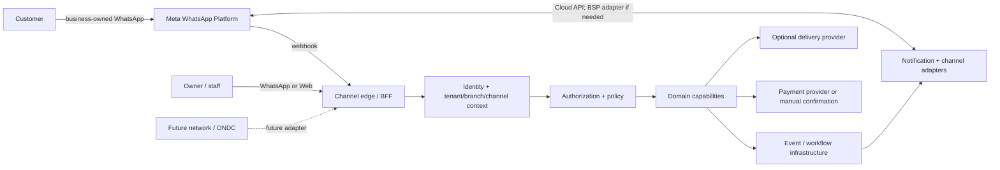

# Architecture

## Status and evidence discipline

This document separates:

- **HLD** — system context, capability ownership, trust boundaries and deployment posture.
- **LLD** — contracts, state transitions, event envelopes, idempotency and concrete flow behavior.

Logical capability boundaries are not a commitment to one deployed service per capability. A boundary becomes a deployment boundary only when a meaningful ownership, data, security, scaling or lifecycle reason exists.

Raw-founder citations use the form `Raw T<number> (message-id)`. The turn
number is a stable, derived chronological index over substantive
`user`/`assistant` text messages in `nekurama.raw.chat.json`, ordered by
`create_time` and then mapping-node ID. For an exact source anchor, use
`nekurama.raw.chat.json#conversation_id=6aa2f947-fce0-83e8-99d0-9a52ab2b15cd;mapping/message=<message-id>`.
Assistant turns are included as recorded decision history; founder-authored
turns remain the primary evidence for product intent.

The current decision log is `nekurama/Bulb#1` (especially §§8-22, §§24-25,
§29 and §31). `historical ManojVysyaraju/bulb#1` remains preserved historical
evidence rather than an independently current decision source.

### Decision-status vocabulary

- **Confirmed** — directly supported by founder intent or an explicit domain invariant; implementation details may still be open.
- **Proposed** — an architecture hypothesis or candidate shape useful for design work; it is not a commitment.
- **Unresolved** — the evidence establishes a requirement or question but does not select an implementation, provider or topology.
- **Non-goal** — explicitly outside the current MVP or architecture handoff.

This document uses those labels to avoid turning research discussion, assistant recommendations or candidate deployment shapes into decisions.

## Committed starting posture

The **Admin Decision Packet (2026-09-20)** establishes the implementation
starting posture for the first product slice:

- **Deployment:** modular monolith with clear domain modules; no initial
  microservices or EKS.
- **Runtime:** TypeScript/Node.
- **Persistence:** PostgreSQL.
- **Asynchronous work:** managed queue plus transactional outbox/inbox
  patterns.
- **Integrations:** provider adapters, with official Meta Cloud API/Tech
  Provider as the WhatsApp target and BSP as a fallback.
- **Authority:** AI is advisory only; deterministic domain capabilities own
  orders, payments, permissions, consent and other controlled business state.
- **Reliability:** idempotency, outbox/inbox, retries, DLQ/quarantine,
  reconciliation and auditability are required from the start.
- **Payments:** direct UPI/gateway merchant settlement; no BABAI wallet or
  escrow.
- **Operations:** AWS credits may be evaluated, but the design remains
  portable and must not overprovision around credits.
- **Continuity baseline:** initial RPO 24 hours and RTO 8 hours, daily backups
  and tested restore.
- **Privacy/security baseline:** DPDPA-ready minimisation, consent,
  retention, deletion, access, subprocessors and incident controls.

This is a **starting posture**, not a claim that the exact cloud services,
queue provider, Meta approval path, workflow implementation, production SLOs
or legal/security controls have been validated. Logical capability and
aggregate boundaries remain independent from the modular-monolith deployment
shape. [Admin Decision Packet (2026-09-20); `architecture-boundaries.md`;
`architecture-lld.md`; `domain-model.md`]

The flow-by-flow implementation handoff is maintained in
[`flow-architecture-matrix.md`](flow-architecture-matrix.md). It records
fourteen flow families, their state ownership, contracts, reliability,
provider boundaries, tier/pilot gates and current implementation/demo status.

### Cost-sensitive pilot recommendation

The proposed pilot posture is one small containerized modular-monolith runtime
plus a managed worker capacity model, managed standard PostgreSQL, a managed
at-least-once queue behind a port, and provider adapters. **ECS/Fargate is the
default AWS pilot candidate** after a like-for-like cost and restore check;
retain a portable OCI baseline and keep App Runner as a time-boxed worker
proof alternative. A small EC2/container host is a cost fallback only because
its patching and recovery work transfers to the founders. Start with the
low/base cost envelope; do not add EKS, Aurora, Multi-AZ, Kafka, multi-region
recovery or long-retention telemetry merely to consume credits.

This recommendation is an internal decision record for pilot evaluation, not
a provider selection. AWS credits, service/region/tier, queue vendor, Meta
approval/BSP terms, payment provider/rates, observability tooling, legal
approvals and production SLOs remain unresolved/input-required. Direct
merchant settlement, RPO 24h/RTO 8h, daily backups/tested restore and
deterministic business-state ownership remain unchanged. See
[`architecture-cost-options.md`](architecture-cost-options.md) for the
comparison, assumptions and validation gates.

### Founder Decision Packet operating posture

The internal recommendation is to keep the first pilot intentionally small:

- **Runtime:** one right-sized API task/container and one worker capacity
  model; scale only from measured request, queue, outbox or database pressure.
- **Data and async:** managed standard PostgreSQL as authoritative state,
  transactional outbox/inbox, managed at-least-once queue, DLQ/quarantine and
  authorized replay.
- **Artefacts:** private encrypted object storage for backups/exports and
  controlled uploads; CDN only for measured public static-asset traffic.
- **Access:** managed secret storage candidate, least-privilege workload
  identities, MFA/security keys for founder/admin access, and audited
  break-glass access.
- **Delivery:** immutable image builds, tests, staged smoke, manual promotion,
  backward-compatible migrations and last-known-good rollback.
- **Operations:** redacted logs, core metrics, actionable alerts and
  correlation IDs; no 24x7 or hiring assumption.

The monthly infrastructure planning envelopes are **₹0–₹10,000 low,
₹10,000–₹30,000 base and ₹30,000–₹100,000+ high before credits**. These are
internal estimates, not quotes, and exclude provider pass-throughs, tax,
support labour and one-time onboarding. Pause enrollment when the proposed
founder support envelope (24 hours/week, 2 hours per active restaurant/week,
recurring P1s, unresolved P2s or overdue restore/reconciliation work) is
exceeded. Revisit the posture only with measured scaling, recovery,
provider-failure or support evidence. See
[`architecture-cost-options.md`](architecture-cost-options.md) for the
comparison, gates and rollback posture.

This recommendation does not claim provider, legal, security, Meta, payment
or external approval. Those decisions remain parked until their stated
validation evidence exists.

The dated implementation sequence, DevOps gates, test plan, rollback posture,
internal reserves and controlled onboarding checks are maintained in
[`architecture-plan-oct-dec-2026.md`](architecture-plan-oct-dec-2026.md).

### Key HLD/LLD decision citation index

The following index is the review handoff for the decisions most likely to be
mistaken for implementation commitments. Each row names exact raw mapping
message UUIDs and the current repository documents that must be read with the
raw evidence.

| Decision area | Raw mapping/message UUIDs | Current repository sources |
|---|---|---|
| Restaurant-owned channel and BABAI operating behind it | Raw T33 `ded20a72-7392-4785-8983-b6e7d75eae3b`; Raw T37 `eadec8d3-a035-43e3-814a-6d3312001bbf`; Raw T47 `1df966d4-0c16-4a9a-b8cb-4375e5c2fda7`; Raw T48 `bbb21b07-0508-4dde-94f1-60e9982ec3e8` | `product-definition.md`; `experience-and-channels.md` |
| Tenant, branch, channel and customer relationship boundaries | Raw T34 `bbb21cdc-296c-4806-af69-c1b7f40c4cf8`; Raw T99 `bbb21fb5-8f72-4a7f-b42b-333101d4a900`; Raw T149 `bbb2129e-e9fa-43bf-adca-b0bc7a956664` | `domain-model.md`; `product-definition.md` |
| Coarse capability boundaries without one-service-per-capability deployment | Raw T153 `bbb21941-90d7-47d8-b4e0-671c6caecb09`; Raw T154 `1764f643-59fd-4cf5-be14-6aee32fc973a`; Raw T157 `bbb21f46-ddff-464d-bb6c-8a47d4188b9a` | `architecture.md`; `domain-model.md` |
| General state/transition and workflow capability; implementation unresolved | Raw T115 `bbb210cc-a1ef-4ea9-b1a7-7c52f0011721`; Raw T117 `bbb216ed-0269-4c6c-8e28-f17031c1fa93`; Raw T119 `bbb211c0-c142-4837-aca7-b67a21454ec8`; Raw T122 `0011555d-10c7-4dbc-aca8-2bf7c55d324b`; Raw T136 `09c90c51-c4ae-40a6-9bd8-aea16eaf3339` | `architecture.md`; `domain-model.md` |
| Versioned, correlated, flow-scoped events and reliable delivery | Raw T125 `bbb21b98-7460-45d5-a616-418ffbf47484`; Raw T137 `bbb21f78-6e9b-4ef8-9a07-60fe2273e772`; Raw T139 `bbb213b8-d58c-403e-b858-bdaa1ac750b8`; Raw T264 `bbb21a7f-4d44-4cc1-8f60-1172bdcc303c`; Raw T268 `bbb21426-5f7e-4c38-82e4-e288b9aae01c` | `architecture.md`; `domain-model.md` |
| Zero-trust, scoped authorization and sensitive-data controls | Raw T139 `bbb213b8-d58c-403e-b858-bdaa1ac750b8`; Raw T144 `548da5a7-b8c7-4fd8-b129-04c2115c9134`; Raw T149 `bbb2129e-e9fa-43bf-adca-b0bc7a956664` | `architecture.md`; `domain-model.md` |
| Direct business payment and staff-owned commercial corrections | Raw T72 `bbb21c29-06e2-44d7-bd05-c2f9c28c3f4f`; Raw T209 `bbb21545-4598-4ecd-a1fa-af977810bd5b`; Raw T216 `bbb216f2-0ccd-4871-a670-e02f94100750`; Raw T218 `bbb21ee2-2265-4c8a-ba89-82249c36e181` | `product-definition.md`; `domain-model.md` |
| AI assistance without authority over controlled state | Raw T410 `bbb21914-7687-4f6e-848a-30e1e7e850f8`; Raw T414 `bbb21eb2-e878-4ef3-a499-f81e1cdc2d83`; Raw T434 `bbb21a5b-1600-43f4-b2db-6456579c3a2f` | `product-definition.md`; `domain-model.md` |

## Current architectural answer

BABAI is a business operating platform built around WhatsApp. Its first validated workflow is restaurant-first: a business-owned channel receives customer conversations, turns structured intent into a cart and order, and coordinates payment, staff operations and pickup-first fulfillment. Web remains the dense configuration and operations surface; WhatsApp remains the immediate conversational/action surface. This matches the product definition and the founder's formulation of BABAI as a platform for customer and operational workflows, not a marketplace or generic chatbot. [Raw T410 `bbb21914-7687-4f6e-848a-30e1e7e850f8`; Raw T414 `bbb21eb2-e878-4ef3-a499-f81e1cdc2d83`; `nekurama.chatgpt.md`; `product-definition.md`]

The architecture therefore has:

1. **A channel edge** that receives and sends messages through provider adapters.
2. **Tenant and context resolution** that maps a destination channel to the business, branch context and customer relationship.
3. **Coarse-grained domain capabilities** that own authoritative state.
4. **Policy, identity and workflow controls** around every state-changing command.
5. **Durable event, audit, reconciliation and telemetry infrastructure** that coordinates side effects without replacing domain state.

### System context (HLD)



The customer normally messages the restaurant's number, not a BABAI directory number. The receiving phone number identifies the connected channel and therefore the tenant; a multi-branch business using one number may still require an explicit branch choice. [Raw T33 `ded20a72-7392-4785-8983-b6e7d75eae3b`; Raw T34 `bbb21cdc-296c-4806-af69-c1b7f40c4cf8`; `domain-model.md`]

## Bounded capabilities and ownership (HLD)

These are conceptual ownership boundaries. They may initially be colocated in one application or a small number of deployables.

| Capability | Owns authoritative state | Does not own |
|---|---|---|
| **Identity and membership** | Global identities, credentials/identity resolution, memberships and role assignments | Tenant business state or order state |
| **Authorization and policy** | Scoped capability decisions, preconditions and policy evaluation | The aggregate state being protected |
| **Tenant / branch / channel** | Billing-account relationship, tenant/business, branch, connected channel, operational configuration and channel lifecycle | Provider transport semantics or customer global identity |
| **Catalog / menu / availability** | Menu structure, immutable revisions, publication and availability | Historical order truth |
| **Conversation / messaging context** | Conversations, messages, automation/human-takeover state and interaction context | Payment, order or fulfillment authority |
| **Cart and ordering** | Cart, order lifecycle, order commands and immutable commercial/order snapshots | Payment settlement or delivery execution |
| **Commercial calculation** | Price, promotion and tax/GST evaluations and their attributable results | The committed order lifecycle; the order freezes the evaluated result |
| **Payment** | Payment intent/state, provider callbacks, reconciliation and refund records | BABAI subscription billing; order acceptance |
| **Fulfillment / delivery / tracking** | Fulfillment lifecycle and optional provider interaction | The order aggregate or payment custody |
| **Billing and entitlements** | BABAI subscription, plan, invoice and feature entitlement | Customer-to-business order payment |
| **Notification / channel integration** | Provider adapters, templates, outbound delivery status and retry behavior | Intent interpretation or domain state transitions |
| **Workflow / reconciliation** | Timers, long-running orchestration, retries, replay and mismatch detection | Authoritative business state |
| **Audit / observability** | Immutable security/business history and telemetry | The source of truth for current domain state |

The domain model's aggregate map remains the authority for transactional ownership: `Tenant`, `Branch`, `Channel`, `TenantCustomer`, `Menu`, `Conversation`, `Cart`, `Order`, `Payment` and `Fulfillment`, with `Promotion` likely a tenant-owned configuration aggregate. Engines/capabilities may span aggregates and are not automatically aggregate roots. [`domain-model.md`]

### Ownership rules

- A capability owns its state and exposes commands/queries/contracts; other capabilities do not read its database directly.
- Cross-capability references use stable IDs and explicit contracts, not embedded authoritative copies.
- Domain state and validated transitions are authoritative. Events coordinate side effects; audit records history; workflow executes processes; telemetry observes.
- `Order` freezes the evaluated commercial result and the relevant menu revision. Later menu, price, promotion or tax changes do not rewrite historical order truth.
- `Payment` and `Fulfillment` are independent state machines. Payment completion does not imply order acceptance.
- Human takeover pauses conversational automation only; order, payment and fulfillment processing continue independently.

## MVP deployment posture versus conceptual boundaries

### MVP deployment (committed starting shape)

The MVP starts as a **modular monolith** with clear domain modules, a
managed-queue worker path and provider adapters:

1. **Channel edge / BFF** for web, WhatsApp webhooks and outbound-provider
   calls.
2. **Core modular-monolith runtime** containing tenant, catalog,
   conversation, cart/order, payment and fulfillment modules.
3. **Managed queue plus outbox/inbox worker path** for menu ingestion,
   outbound delivery, retries, timers, reconciliation and recovery.
4. **External provider adapters** for Meta/WhatsApp, payment and optional
   delivery providers.
5. **Audit/observability facilities** with access controlled separately from
   business state.

There is **no initial microservices or EKS commitment**. Domain modules and
contracts must remain clear enough to extract a capability later when
security, data ownership, scaling, provider-failure containment, lifecycle or
operational evidence justifies it. TypeScript/Node and PostgreSQL are the
starting implementation choices; the exact cloud services, managed queue,
deployment packaging and workflow product remain validation work. [Admin
Decision Packet (2026-09-20); Raw T153
`bbb21941-90d7-47d8-b4e0-671c6caecb09`; Raw T154
`1764f643-59fd-4cf5-be14-6aee32fc973a`; `architecture-lld.md`;
`architecture-boundaries.md`]

### Pilot platform support boundaries

The deployment shape must keep these concerns replaceable and operationally
small:

- private object storage holds backups, exports and controlled artefacts;
  public static assets may use a CDN only after measured need;
- secrets are retrieved from a managed or equivalent encrypted store, never
  from source control or general telemetry; founder/admin access uses MFA and
  audited break-glass procedures;
- CI/CD produces immutable container images, runs tests and smoke checks,
  promotes manually during the pilot, and supports last-known-good rollback
  with backward-compatible migrations;
- logs and metrics are redacted, correlated and alertable without becoming
  business-state authority.

These are architectural boundaries, not provider selections. The ECS/Fargate,
App Runner and small EC2/container comparison, monthly planning envelopes,
founder-support gates and rollback triggers are maintained in
[`architecture-cost-options.md`](architecture-cost-options.md).

### New scale baseline and runtime split

The scale model uses the founder inputs of 54 average requests/order, 90
heavy-case requests/order, 50 orders/day/restaurant, 500 and 1,000
restaurants, and 10/25/50/100% conversion sensitivities. The canonical
formulas, 1x/5x/10x RPS bands, cost comparison and Stage 0/1/2 15-minute
capacity gates are in
[`architecture-cost-options.md`](architecture-cost-options.md).

The gateway is intentionally stateless and lightweight: authenticate and
verify, rate-limit, classify, enqueue and acknowledge only after durable queue
acceptance. Conversation/state processing, provider fan-out, retries,
reconciliation and workflow execution belong to idempotent workers behind the
outbox/inbox and queue boundary. PostgreSQL is protected from per-hit gateway
transactions through queue admission, cacheable published revisions, bounded
worker concurrency and short module-scoped transactions; authoritative order,
payment, permission, consent and reconciliation decisions still use
PostgreSQL.

Rate limits, backpressure, provider token buckets, retry/DLQ rules, connection
pool allocation, safe-cache restrictions, restore gates and founder support
replacement triggers are operating guardrails rather than production SLO
claims. A two-gateway or 2x2-vCPU setup does not prove capacity; only the
specified load tests and 15-minute signals can do that. Founder-only support
fails at 500+ restaurants by default under the 24-hour/week ceiling unless
automation or replacement support reduces manual work to the measured
per-restaurant minute budget.

### LLD boundary

The first implementation should make these contracts explicit inside the
modular monolith even when code is colocated:

- inbound channel message/webhook contract;
- context-resolution and authorization command contract;
- aggregate command and validated-transition contract;
- event envelope and schema registry;
- provider adapter contract;
- idempotency, retry and reconciliation contract;
- audit and sensitive-data access contract.

PostgreSQL, TypeScript/Node, managed queue/outbox and provider adapters are
the committed starting posture. Exact REST/gRPC/GraphQL choice, serialization,
queue vendor, cloud services, workflow engine and deployment packaging remain
unknown. The raw discussion explored gRPC/Protobuf and asynchronous flows, but
did not establish a production protocol decision. [Admin Decision Packet
(2026-09-20); Raw T163 `bbb2111f-375d-4b57-b543-441369f304ec`; Raw T185
`bbb211a0-56e1-4951-bb51-9ee3f587f7d8`; Raw T195
`bbb21fcf-8976-43bb-a749-8a7ae584a904`; Raw T200
`1aaa80e7-2767-49ae-8054-8d0fb81f4fc0`; `architecture-lld.md`]

## State engine and workflow posture (HLD/LLD)

**Confirmed requirement:** BABAI needs a state/transition capability for business flows, not only for payment processing. The founder explicitly broadened the requirement to a general state engine and then listed idempotency, transactions, retries, timers, human waits/interventions, audit history and recovery as functional needs. [Raw T115 `bbb210cc-a1ef-4ea9-b1a7-7c52f0011721`; Raw T117 `bbb216ed-0269-4c6c-8e28-f17031c1fa93`; Raw T119 `bbb211c0-c142-4837-aca7-b67a21454ec8`]

The HLD boundary is therefore the separation between:

- authoritative domain state and validated transitions owned by the relevant aggregate/capability; and
- durable workflow execution that coordinates timers, retries, asynchronous work, human intervention and recovery around that state.

The LLD must define state schemas, transition commands, preconditions, transition authorization, event effects, idempotency, timeout/timer behavior, human-wait behavior, retry/compensation behavior, audit history and recovery/replay semantics. These requirements apply to ordering, payment, fulfillment, conversation, onboarding and other long-running flows as they become material.

The following remain **unresolved**:

- whether state handling is one generic framework, flow-specific state machines, or a constrained combination;
- whether workflow execution is custom, open source or a managed platform;
- whether a durable workflow product such as Temporal is suitable; it is explicitly not selected during research;
- where workflow records, event history, timers and recovery metadata are stored;
- the exact boundary between domain transitions, workflow orchestration and integration retry logic;
- the sync/async contract and operational ownership for each flow.

The founder's research-stage position was to define the State Engine contract and compare alternatives before choosing an implementation; it did not authorize locking Temporal or another product. [Raw T122 `0011555d-10c7-4dbc-aca8-2bf7c55d324b`; Raw T136 `09c90c51-c4ae-40a6-9bd8-aea16eaf3339`; this document's open questions]

## Data, events and reliability (LLD)

### Command and state transition pattern

```text
Inbound message / UI action
  -> authenticate and verify provider context
  -> resolve identity, tenant, branch, channel and session
  -> authorize command and evaluate policy/preconditions
  -> load the owning aggregate
  -> validate an explicit state transition
  -> persist authoritative state and an outbox record atomically
  -> publish/dispatch the event
  -> run idempotent consumers, notifications, workflow and reconciliation
```

Customer interactions may be synchronous, asynchronous or hybrid by use case: status reads can be synchronous; placing an order needs a bounded command response plus asynchronous side effects; payment confirmation, notifications and delivery are event-driven where appropriate. The exact matrix is a design-phase artifact, not a global “everything async” rule. [Raw T165 `bbb21849-7c34-4782-a440-5be8c75acb62`; Raw T201 `bbb21dde-e359-4e19-b211-634eb6b5d917`; Raw T202 `293ad099-4f4c-4e6c-a554-42d55cc8677b`]

### Event rules

The founder's durable event requirements are:

- every event has a unique event identity and a versioned type/schema;
- related events carry correlation and causation context, with session/flow context where applicable;
- event type is derived by the trusted edge/domain context, not accepted blindly from a client;
- events are flow-scoped and must not authorize unrelated flows;
- event contracts are explicit and versioned; an old version must be handled deliberately, not as an opaque server failure;
- event transport is not the authoritative domain database.

The exact event code registry (for example, whether human-readable names also receive numeric families), envelope fields, retention and query store remain open. [Raw T125 `bbb21b98-7460-45d5-a616-418ffbf47484`; Raw T129 `bbb21da2-975e-4aaa-b1a4-05542d023114`; Raw T137 `bbb21f78-6e9b-4ef8-9a07-60fe2273e772`; Raw T139 `bbb213b8-d58c-403e-b858-bdaa1ac750b8`; Raw T268 `bbb21426-5f7e-4c38-82e4-e288b9aae01c`]

A minimum event envelope should be designed to carry, subject to data classification:

```text
eventId
eventType
schemaVersion
occurredAt / recordedAt
producer
tenantId / branchId where applicable
actor or subject reference
aggregateType / aggregateId
correlationId
causationId
sessionId / flowId where applicable
idempotencyKey
classification
payload reference or typed payload
```

### Delivery guarantees and failure handling

Use at-least-once delivery with:

- transactional outbox at the authoritative writer;
- inbox/deduplication at consumers;
- idempotent commands and provider callbacks;
- bounded retries with backoff;
- a dead-letter/quarantine path that distinguishes retryable, non-retryable and human-action cases;
- replay only under explicit authorization and version rules;
- reconciliation against Meta, payment and delivery providers;
- alerts to the correct platform, tenant, staff or customer actor.

The system must not silently convert a failed event or provider callback into success-shaped state. The exact broker and workflow implementation are unknown. [Raw T125 `bbb21b98-7460-45d5-a616-418ffbf47484`; Raw T126 `e472fe3d-22d5-4595-aafd-986683b13a3c`; Raw T264 `bbb21a7f-4d44-4cc1-8f60-1172bdcc303c`; `domain-model.md`]

## Thin/placeholder artifact inventory

Before this handoff, `docs/products/babai/architecture.md` was the only
architecture-specific thin artifact: it contained a short current answer and a
question list, but no ownership map, HLD/LLD boundary, integration seams,
data/reliability contract or source anchors. This file now fills that gap
without turning design-stage hypotheses into confirmed deployment decisions.

The adjacent files are substantive partial inputs, not architecture
placeholders:

- `domain-model.md` owns aggregate, invariant and commercial-engine decisions.
- `product-definition.md` owns the MVP/product boundary and pilot constraints.
- `experience-and-channels.md` owns channel and human-takeover experience.
- `docs/README.md` owns knowledge-base mining/status rules rather than system
  architecture.

## Explicit open questions

These questions remain intentionally unresolved; the architecture must not
infer answers from the candidate boundaries above:

- Final MVP deployment topology, packaging, environment model and capability
  extraction sequence.
- PostgreSQL schema/module layout, transaction boundaries, tenancy
  partitioning, migrations, retention, backup and disaster recovery details.
- Managed queue selection, partition and ordering guarantees, schema registry,
  replay tooling and retention.
- Workflow engine selection, including whether Temporal or another engine is
  justified after the design/POC phase.
- Policy engine selection and the detailed threat model, key management and
  abuse controls.
- Meta production onboarding, coexistence, webhook behavior, messaging
  policy/templates and multi-agent operation.
- Payment provider, payment verification, refunds, reconciliation and unit
  economics.
- Delivery provider contracts and the delivery/tracking lifecycle split.
- AI model/provider architecture, data handling, evaluation, multilingual
  behavior, guardrails and escalation policy.
- Production SLOs beyond the initial RPO 24h/RTO 8h baseline,
  observability/support design and cost/scaling thresholds.
- AWS service selection, portability tests and whether credits improve
  economics without overprovisioning.
- DPDPA implementation evidence, legal review, subprocessors, incident
  controls, encryption/key management and access-review operation.
- Remaining aggregate invariants and transition rules, including promotion
  stacking, combo/bundle modeling, tax/rounding provenance and high-contention
  promotion limits.

These open questions are consistent with `nekurama/Bulb#1` §31 and the
remaining battles in `domain-model.md`; they are evidence gaps, not silent
architecture commitments.

## WhatsApp / Meta and channel topology

### Target topology

```text
Restaurant business
  -> owns Meta business assets / WABA / phone identity
  -> authorizes BABAI through Meta onboarding
  -> BABAI operates as the technology/platform layer
  -> Meta Cloud API carries webhooks and outbound messages
```

The target is Meta Tech Provider plus direct Cloud API. A BSP may be used as a temporary bridge or fallback behind the same provider adapter; it must not become an implicit domain dependency. The restaurant should retain its business identity and be able to leave BABAI without losing the number. [Raw T37 `eadec8d3-a035-43e3-814a-6d3312001bbf`; Raw T47 `1df966d4-0c16-4a9a-b8cb-4375e5c2fda7`; Raw T48 `bbb21b07-0508-4dde-94f1-60e9982ec3e8`; Raw T49 `a88bb749-f1c7-4f6b-baa6-e6428f29c800`]

The product-facing channel abstraction must remain provider-neutral:

```text
Channel
  -> provider adapter
  -> provider account / phone identity
  -> tenant and optional branch context
```

Do not make a WABA ID the permanent domain identity of a channel; Meta's account model and partner relationships may evolve. WhatsApp is the primary channel, not the only conceptual channel. [Raw T65 `31e96409-07af-4d5c-a00c-fbe2a55c0433`; `experience-and-channels.md`]

### Existing numbers and messaging policy

Existing-number coexistence is an onboarding target and an explicit validation dependency, not a blanket promise. The exact Meta eligibility, history synchronization, app/API interaction, disconnect behavior and limitations remain unknown. [Raw T51 `e305d46c-dbf1-4875-b1b1-58a381a9f86a`; Raw T53 `d4db986d-7bc2-4b25-becd-d8477cdb8797`; `product-definition.md`]

Notification policy must keep these categories distinct:

- customer-initiated service responses;
- transactional/order and payment updates;
- support/human escalation;
- marketing/re-engagement with separate consent and provider rules.

Provider templates, service windows, Direct Send eligibility, opt-out handling and India-specific compliance need current implementation validation. They are not a reason to collapse notification, conversation or consent into one generic state. [Raw T63 `2f7e2590-8665-4398-b7d6-334e994d4ab2`; Raw T65 `31e96409-07af-4d5c-a00c-fbe2a55c0433`]

## AI authority boundary

AI may assist with:

- intent and message understanding;
- menu/document extraction and normalization;
- answers grounded in approved tenant/catalog context;
- summarization, recommendations and suggested actions;
- operator assistance and routing.

AI is **not authoritative** for:

- tenant, branch or customer relationship resolution;
- identity, authentication, authorization or consent;
- order, payment, refund, fulfillment or subscription state;
- price, tax, promotion or invoice commitment;
- data deletion/retention decisions;
- external side effects.

An AI suggestion must become a typed command, pass trusted policy and domain validation, and require a human decision where the product boundary says so. Restaurant staff remain the decision-maker for order modification and cancellation; the domain service validates the transition and emits the consequences. AI is advisory only: deterministic services own orders, payments, permissions, consent and other controlled business state. [Admin Decision Packet (2026-09-20); Raw T209 `bbb21545-4598-4ecd-a1fa-af977810bd5b`; Raw T212 `3b8ef53b-6082-4581-9afd-72f155a9b2da`; Raw T216 `bbb216f2-0ccd-4871-a670-e02f94100750`; Raw T218 `bbb21ee2-2265-4c8a-ba89-82249c36e181`; `product-definition.md`]

## Security and tenant isolation

### Tenant and identity model

- `Tenant` is the business/business group, not a branch.
- `Branch` is an operational and authorization/data scope.
- `Channel` is a tenant/branch communication endpoint.
- Customer identity can be global, but every restaurant relationship, consent, conversation, order and customer-facing operation is tenant-scoped.
- A customer request to delete data defaults to the active tenant relationship; it does not silently delete other tenant relationships. Financial, legal and audit retention requirements still need explicit policy.
- Phone number is an identity-resolution key, not the immutable customer ID.

This preserves future platform-level capabilities without exposing one restaurant's relationship or data to another. [Raw T99 `bbb21fb5-8f72-4a7f-b42b-333101d4a900`; Raw T102 `fa5fecac-d416-4c7e-aa77-f3d9d77978bd`; Raw T149 `bbb2129e-e9fa-43bf-adca-b0bc7a956664`; `domain-model.md`]

### Enforcement rules

- Authenticate external actors and service/workload identities separately.
- Enforce authorization at trusted boundaries using identity, membership, role, capability, scope, resource and policy.
- Use least-privilege service identities and deny cross-tenant access by default.
- Carry tenant/branch/flow context through commands and events, but never trust client-supplied context without re-resolution.
- Audit sensitive reads, writes, authorization decisions, provider changes and data-access exceptions.
- Do not place unrestricted PII, credentials or payment secrets in events or general telemetry.

Zero-trust service authentication and policy-at-boundary are architectural requirements; the token mechanism, policy language, policy cache/revocation, encryption/key management and exact data-classification taxonomy remain LLD/security work. The founder's White/Green/Yellow/Red classification is retained as a proposal, not a locked standard. [Raw T139 `bbb213b8-d58c-403e-b858-bdaa1ac750b8`; Raw T144 `548da5a7-b8c7-4fd8-b129-04c2115c9134`; Raw T149 `bbb2129e-e9fa-43bf-adca-b0bc7a956664`; Raw T153 `bbb21941-90d7-47d8-b4e0-671c6caecb09`]

### Privacy and operational baseline

The starting implementation must be DPDPA-ready in design and operations:

- minimise collection and exposure;
- record purpose- and channel-scoped consent;
- define retention and deletion behavior;
- enforce scoped access and audit sensitive operations;
- maintain a subprocessors register and provider-data boundaries;
- define incident detection, escalation and notification controls.

This is a readiness baseline, not a legal certification. Exact notices,
retention periods, processor terms, cross-border/data-location requirements,
incident obligations, encryption/key management and access-review cadence
remain legal/security validation work. [Admin Decision Packet (2026-09-20);
`domain-model.md`; `docs/company/security-privacy-controls.md`]

## Reliability and continuity baseline

The initial operational baseline is **RPO 24 hours** and **RTO 8 hours**, with
daily backups and a tested restore procedure. PostgreSQL is the authoritative
starting persistence choice; backup storage, restore automation, regional
placement, monitoring and the exact recovery runbook remain to be validated.

AWS credits may be evaluated for cost reduction, but the architecture remains
portable and must not overprovision or introduce AWS-only coupling merely to
consume credits. The exact AWS services, queue provider, production SLOs,
capacity thresholds, observability ownership, DR design and cost model remain
open. [Admin Decision
Packet (2026-09-20); `architecture-lld.md`; `architecture-boundaries.md`]

The cost, provider and founder-support alternatives are recorded in
[`architecture-cost-options.md`](architecture-cost-options.md). That artifact
is a comparison and validation aid, not a final provider decision.

## Tiered capability boundary

The **Tier Scope Decision (2026-09-21)** treats LITE, BASE and PRO as
provisional entitlement experiments over the same deterministic domain
capabilities. A tier gates commands, quotas, provider integrations and
support cost; it must not create a second source of truth, a separate
deployment, or AI authority over controlled business state.

| Capability boundary | LITE | BASE | PRO |
|---|---|---|---|
| Core ordering | Menu display, bounded menu assistance and deterministic order capture/status | LITE plus validated cart/order and staff workflow | BASE plus approved advanced workflow/API surfaces |
| Payment | **Out of scope**; no payment workflow or provider adapter | Direct merchant settlement through a validated payment adapter | Same settlement boundary plus approved advanced provider/API paths |
| Fulfillment/delivery | **Out of scope**; no delivery workflow | Pickup plus delivery where a validated provider flow exists | BASE plus approved advanced delivery integrations |
| Availability | **Out of scope**; no item-availability workflow or daily automation | Deterministic item availability controls in menu/cart/order validation | BASE plus approved availability integrations |
| Promotions/combos | **Out of scope** | Basic bounded controls; maximum 3 requests/day with short-lived activation | Advanced bounded workflows under policy and measured quota |
| Conversational scope | Limited menu assistance and order capture; no operations automation claim | Bounded menu, order, payment and delivery tasks | Broader bounded conversational tasks and advanced API integrations; never unrestricted AI authority |

The tier is an authorization/entitlement input at the trusted command
boundary, not a hint to the model. LITE absence means the corresponding
commands, state transitions, provider calls and UI actions are unavailable,
not merely hidden. BASE and PRO still require provider capability, tenant
configuration, policy approval and operational evidence before activation.
“Full access” in PRO means full access to the explicitly allowed product
surface only: AI remains non-authoritative and cannot commit order, payment,
refund, delivery, availability, promotion, combo, permission or consent state.

All tiers use deterministic, separately owned state machines. Order state is
never inferred from payment or delivery state:

```text
Order:      DRAFT -> SUBMITTED -> ACCEPTED/REJECTED
            ACCEPTED -> PREPARING -> READY -> COMPLETED
Payment:    NOT_APPLICABLE (LITE)
            PENDING -> AUTHORIZED/PAID -> FAILED
            PAID -> REFUND_PENDING -> REFUNDED
Fulfillment: NOT_APPLICABLE (LITE)
             PICKUP: READY_FOR_PICKUP -> COMPLETED
             DELIVERY: REQUESTED -> ASSIGNED -> IN_TRANSIT -> DELIVERED
```

Each transition is authorized, policy-checked, idempotent and recorded with
tenant/branch, tier, actor/mode, correlation and causation context. Delivery
and payment states may be absent in LITE; they must not be represented as
successful, and payment completion never implies order acceptance. Human
takeover is first-class in every tier and pauses conversational automation
without pausing authoritative order, payment or fulfillment processing.

Menu updates, promotion/combo requests and API calls are policy inputs rather
than client claims: LITE permits at most three menu updates per month and no
promotion/combo workflow; BASE permits basic promotion/combo requests up to
three per day, each active for one day or another configured short period;
PRO uses approved measured limits. Provider/account limits, rate limits and
backpressure remain binding even when a tier quota is higher. Promotions,
combos, payment, fulfillment and availability remain owned by their domain
capabilities, not billing, AI or the gateway.

This is an internal architecture implication of the provisional matrix, not a
provider approval, payment/delivery contract, final deployment choice or
public pricing decision. [Tier Scope Decision (2026-09-21); Raw T21
`bbb21b01-c1d5-42f9-9e1f-702bb346453c`; Raw T35
`97f25c92-127f-4c8c-bde9-c314010cbef7`; Raw T410
`bbb21914-7687-4f6e-848a-30e1e7e850f8`; `product-definition.md`;
`domain-model.md`; `architecture-cost-options.md`]

## Payment custody boundary

Customer order money should flow directly to the business through supported
UPI or gateway merchant settlement. BABAI does not custody customer funds,
operate a wallet or escrow, or become the merchant of record by default for
the initial product. BABAI's own subscription billing is a separate
commercial flow. The exact provider, settlement, refund and reconciliation
implementation remains validation work. [Admin Decision Packet (2026-09-20);
Raw T72 `bbb21c29-06e2-44d7-bd05-c2f9c28c3f4f`; `product-definition.md`]

Consequences:

- `Payment` remains separate from `Order`.
- Supported payment providers, UPI/manual confirmation and callbacks are adapter concerns until selected.
- Payment confirmation is evidence about payment state, not automatic order acceptance.
- Manual payment correction, order modification and refund decisions remain restaurant-owned, auditable actions.
- Invoice revisions and pending/refund corrections must preserve the agreed commercial history rather than overwrite it.
- Delivery-provider charges and settlement are not BABAI custody by implication; exact commercial responsibility remains a product/legal question.

The provider, settlement, refund and reconciliation implementation is unknown.
[Raw T68 `bbb21613-1461-4278-a34f-d4c055c03c84`; Raw T76
`bbb21803-3975-4faf-9eda-c51cade91dfe`; Raw T214
`bbb21c1a-3430-49da-9c8d-5f9edbc4dc87`; Raw T216
`bbb216f2-0ccd-4871-a670-e02f94100750`]

## Explicit non-goals and unknowns

### Non-goals for the current architecture

- consumer marketplace/discovery or a BABAI-owned customer channel;
- customer native app;
- POS/ERP replacement;
- full warehouse/inventory suite;
- owning a delivery fleet;
- broad marketing automation;
- advanced BI/data warehouse product;
- ONDC integration as an MVP workstream;
- general-purpose AI assistant outside the business workflow;
- premature Kubernetes/cloud/broker/database/workflow selection;
- one microservice per entity or capability.

These align with the MVP boundary and the founder's explicit intent that the product should not become Swiggy/Zomato or a customer marketplace. [Raw T352 `bbb21411-4f42-4fe8-938d-c2d34e758a13`; Raw T354 `bbb219ab-0e1e-4617-bbd9-b6b930e06e93`; Raw T567 `f1483d02-c668-4577-9543-080e2d12080a`; `product-definition.md`]

### Open design questions

- exact MVP deployable split and extraction triggers;
- state-engine contract, flow coverage and transition ownership;
- generic versus flow-specific state modeling;
- durable workflow implementation, timer/human-wait semantics and recovery/replay controls;
- authoritative storage, read models/projections and retention;
- event code registry, schema governance, event history store and replay controls;
- exact sync/async matrix, transport and workflow implementation;
- Meta Tech Provider approval, coexistence limitations, WAAC/PMA lifecycle and provider billing;
- channel disconnect/export/portability behavior;
- exact tenant/branch invariants and deletion/retention policy;
- data classification, encryption, secret storage and token/revocation model;
- production SLOs, capacity thresholds, disaster recovery and cost model;
- observability signal ownership, telemetry retention/sampling and support
  alert thresholds;
- object-storage retention/export format, CDN use and access-control
  boundaries;
- secret-store/key ownership, MFA/recovery access, CI/CD promotion controls
  and rollback evidence;
- exact AWS credits, service rates, Meta/BSP/payment rates, tax treatment and
  legal approvals;
- exact promotion stacking, tax/rounding, delivery/tracking and reconciliation rules;
- ONDC role and integration, if evidence later makes it material.

## Evidence register

| Architectural fact | Founder evidence | Supporting source |
|---|---|---|
| Restaurant-owned channel; BABAI behind the restaurant's WhatsApp | Raw T33 `ded20a72-7392-4785-8983-b6e7d75eae3b`; Raw T37 `eadec8d3-a035-43e3-814a-6d3312001bbf` | `product-definition.md`, `experience-and-channels.md` |
| Business/tenant, branch and channel are distinct; customer relationship is tenant-scoped | Raw T34 `bbb21cdc-296c-4806-af69-c1b7f40c4cf8`; Raw T99 `bbb21fb5-8f72-4a7f-b42b-333101d4a900`; Raw T149 `bbb2129e-e9fa-43bf-adca-b0bc7a956664` | `domain-model.md` |
| Direct Meta target, BSP as adapter/fallback, coexistence still partial | Raw T47 `1df966d4-0c16-4a9a-b8cb-4375e5c2fda7`; Raw T48 `bbb21b07-0508-4dde-94f1-60e9982ec3e8`; Raw T51 `e305d46c-dbf1-4875-b1b1-58a381a9f86a` | `product-definition.md` |
| Event identity, versioning, correlation, flow scoping and reliable delivery | Raw T125 `bbb21b98-7460-45d5-a616-418ffbf47484`; Raw T137 `bbb21f78-6e9b-4ef8-9a07-60fe2273e772`; Raw T139 `bbb213b8-d58c-403e-b858-bdaa1ac750b8`; Raw T264 `bbb21a7f-4d44-4cc1-8f60-1172bdcc303c` | `domain-model.md` |
| Zero-trust, scoped authorization and coarse capability boundaries | Raw T139 `bbb213b8-d58c-403e-b858-bdaa1ac750b8`; Raw T153 `bbb21941-90d7-47d8-b4e0-671c6caecb09`; Raw T157 `bbb21f46-ddff-464d-bb6c-8a47d4188b9a` | `domain-model.md` |
| Direct business payment, no initial custody, staff-owned corrections | Raw T72 `bbb21c29-06e2-44d7-bd05-c2f9c28c3f4f`; Raw T209 `bbb21545-4598-4ecd-a1fa-af977810bd5b`; Raw T216 `bbb216f2-0ccd-4871-a670-e02f94100750` | `product-definition.md`, `domain-model.md` |
| AI assists; controlled business state remains deterministic/human-authorized | Raw T410 `bbb21914-7687-4f6e-848a-30e1e7e850f8`; Raw T414 `bbb21eb2-e878-4ef3-a499-f81e1cdc2d83`; Raw T434 `bbb21a5b-1600-43f4-b2db-6456579c3a2f` | `product-definition.md` |
| ONDC is future/network-neutral, not an MVP commitment | Raw T566 `bbb21e3d-91a3-48de-90a7-986c6beb716b`; Raw T567 `f1483d02-c668-4577-9543-080e2d12080a` | `product-definition.md` |
