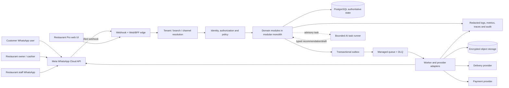

# BABAI End-to-End Architecture

This document is the implementation-oriented architecture handoff for BABAI:
restaurant-owned WhatsApp ordering and operations, with a dense Pro web
operations surface. It joins the current BRD, domain model, HLD and LLD into
one reviewable path from an inbound message to a durable business outcome.

It does not approve Meta/provider onboarding, cloud contracts, payment
settlement, tax treatment, legal wording or public product claims. Those remain
external validation gates in the existing company and pilot documents.

## 1. Decision summary

| Area | Recommended starting decision | Status |
|---|---|---|
| Application shape | TypeScript/Node modular monolith with explicit domain modules and ports | **Confirmed starting posture** |
| Authoritative state | PostgreSQL; aggregates and transactional invariants remain the source of truth | **Confirmed starting posture** |
| Async effects | Transactional outbox/inbox, managed at-least-once queue, worker, DLQ/quarantine and authorized replay | **Confirmed reliability posture** |
| WhatsApp | Official Meta Cloud API/Tech Provider adapter first; BSP behind the same port as fallback | **Target; approval unresolved** |
| Pro UI | Web/BFF read-model and command surface for high-volume restaurant operations | **Required product direction** |
| AI | Advisory task runner for extraction, classification, drafting and routing; never direct authority over controlled state | **Confirmed invariant** |
| Workflow | Typed flow-specific state machines in the domain modules plus a small durable orchestration layer for timers/retries/human waits | **Recommended implementation** |
| Workflow product | Do not adopt Temporal/LangGraph as the system of record at pilot scale; reassess when durable timers, fan-out or recovery evidence justifies it | **Recommended cost/control choice** |
| Payment | Direct merchant settlement; no BABAI wallet, escrow or pooled customer funds | **Confirmed boundary** |
| Deployment | One API runtime, one worker capacity model, managed standard PostgreSQL, queue, object storage, secrets and minimal observability | **Least-cost pilot target** |
| Extraction trigger | Separate deployable/service only for measured scaling, security, failure-isolation or ownership need | **Confirmed architecture rule** |

## 2. System context



### Trust boundaries

1. **Provider boundary:** verify Meta/provider signatures and callback
   identity before creating a durable inbound event.
2. **Channel context boundary:** resolve provider number, tenant, branch and
   channel; never trust tenant/branch IDs supplied by a client message.
3. **Command boundary:** authenticate actor, evaluate scope and entitlement,
   validate the aggregate transition, then commit state plus outbox plus audit
   atomically.
4. **AI boundary:** AI receives a classified, minimised task and may return a
   typed proposal; only deterministic application code can issue a state
   changing command.
5. **Provider side-effect boundary:** payment, delivery and messaging adapters
   own external IDs, callback verification, idempotency, retries and
   reconciliation. They do not own BABAI domain truth.

## 3. Logical modules

The modules are dependency boundaries, not mandatory services.

| Module | Owns | Allowed dependencies |
|---|---|---|
| `identity` | identities, memberships, staff accounts | identity provider port |
| `authorization` | role/scope/policy decisions | identity, tenant context |
| `tenant` | billing account, tenant, branch, channel | identity, provider references |
| `catalog` | menu revisions, items, modifiers, availability | tenant/branch |
| `conversation` | conversation, message, human takeover state | channel, tenant customer |
| `commercial` | prices, combos, promotions, tax calculation capsule | catalog, tenant config |
| `cart` | mutable customer intent | catalog, commercial |
| `order` | committed order, order transitions, corrections | cart, commercial, policy |
| `payment` | intents, callbacks, reconciliation, refunds | order reference, provider port |
| `fulfillment` | pickup/delivery lifecycle and tracking | order reference, provider port |
| `billing` | BABAI subscription, invoices, entitlements | billing account |
| `notification` | templates, outbound intent and delivery state | consent, provider port |
| `support` | cases, assignments, takeover, resolution | conversation, order, authorization |
| `workflow` | timers, retries, waits, reconciliation jobs | typed commands/events only |
| `analytics` | derived projections and metrics | event subscriptions/read models |
| `audit` | immutable sensitive/business operation evidence | domain events, access policy |

No module reads another module's tables directly. Queries cross a typed
application contract or a versioned projection. The authoritative aggregate
module decides whether a command is valid.

## 4. Canonical request paths

### 4.1 Customer WhatsApp order

```text
Meta webhook
  -> verify signature + provider event id
  -> persist InboundMessageReceived/idempotency record
  -> acknowledge provider after durable queue acceptance
  -> resolve tenant/branch/channel/customer relationship
  -> load conversation and current menu revision
  -> classify message (deterministic parser first; AI advisory task if needed)
  -> produce typed command proposal
  -> validate command against policy, menu, cart and order state
  -> commit state + outbox + audit in PostgreSQL
  -> worker renders/sends reply, payment link or status update
  -> provider callback reconciles delivery/payment truth
```

### 4.2 Restaurant WhatsApp operation

The restaurant owner/cashier/staff user is the actor. BABAI/NEKURAMA is the
operations assistant. A message such as “hide chicken biryani today” becomes
`ChangeAvailability`, not an AI-authored database mutation. The command is
scoped to the tenant/branch and requires the role policy for that operation.

### 4.3 Pro web operation

```text
Browser -> Web/BFF
  -> authenticated session + CSRF/origin controls
  -> tenant/branch/role resolution
  -> read versioned projection for board/table
  -> show freshness and conflict state
  -> submit typed command with expected aggregate version
  -> domain validates current authoritative state
  -> commit command/outbox/audit
  -> projection and notification update asynchronously
```

The UI may display stale data, but it must not silently apply a write against
stale state. Commands carry `expectedVersion`; a conflict returns a visible
refresh/review result.

## 5. State ownership and invariants

### Order

```text
DRAFT -> SUBMITTED -> ACCEPTED | REJECTED
ACCEPTED -> PREPARING -> READY -> COMPLETED
SUBMITTED/ACCEPTED/PREPARING -> CANCELLATION_REQUESTED -> CANCELLED
```

- Payment confirmation never accepts an order.
- Customer/AI cannot directly alter a committed order.
- Staff corrections create an auditable correction request and a new
  commercial/payment result where required.
- The committed order snapshots menu revision, prices, promotions, taxes and
  totals.

### Payment

```text
NOT_REQUIRED -> PENDING -> AUTHORIZED -> PAID
PENDING -> FAILED
PAID -> REFUND_REQUESTED -> REFUNDED | REFUND_FAILED
```

- Provider callbacks are verified and deduplicated by provider event ID plus
  tenant/channel scope.
- `PAID` is not inferred from a user message alone.
- A pending balance created by a staff correction is a new payment intent
  linked to the original order/correction.

### Fulfillment

```text
PICKUP: READY_FOR_PICKUP -> COLLECTED -> COMPLETED
DELIVERY: REQUESTED -> QUOTED -> BOOKED -> ASSIGNED -> IN_TRANSIT -> DELIVERED
```

Delivery provider state cannot mutate payment or order authority directly.
Pickup handoff codes are short-lived, scoped, single-use secrets; only
verification changes the handoff state.

### Support

```text
OPENED -> ASSIGNED -> IN_PROGRESS -> WAITING_CUSTOMER
       -> RESOLVED -> REOPENED
```

Support assignment is a command with tenant/branch scope. Staff can act on
the order only within their assigned role and case scope. Resolving a case
does not imply payment, order acceptance or fulfillment completion.

## 6. Code-ready contracts

The canonical TypeScript command, event and adapter contracts live in
[`contracts.ts`](contracts.ts). All WhatsApp cards, restaurant WhatsApp
actions, Pro UI buttons, provider callbacks and recovery tools must compile
against those contracts rather than copying a smaller inline variant.

## 7. Persistence and transaction rules

PostgreSQL is one logical database with schema/module ownership. A single
transaction must include:

1. aggregate state mutation;
2. optimistic version check;
3. outbox record(s);
4. idempotency result;
5. required audit record.

Read models, search indexes, metrics and notification delivery status are
derived. They can be rebuilt from durable events and source state. The system
must expose projection freshness and not use a stale projection as an
authoritative write source.

Minimum tables/modules:

```text
tenant, branch, channel, membership, role_assignment
menu, menu_revision, menu_item, availability_override
conversation, conversation_message, takeover_case
cart, cart_item, order, order_item, order_correction
payment_intent, payment_event, refund, reconciliation_case
fulfillment, delivery_attempt, pickup_handoff
subscription, invoice, entitlement
outbox, inbox, idempotency_key, audit_event
projection_checkpoint, support_case, support_assignment
```

## 8. Least-cost deployment shape

### Pilot

- one containerized API/BFF task;
- one worker process/capacity model;
- managed standard PostgreSQL with backups;
- managed queue with DLQ;
- encrypted object storage for menu uploads, exports and backups;
- managed secrets;
- redacted structured logs, metrics and actionable alerts;
- no EKS, Kafka, Aurora, multi-region or 24x7 staffing assumption.

### Scale trigger

Split a module only after measured evidence of one or more:

- independent scaling pressure;
- security/isolation requirement;
- provider failure isolation;
- deploy cadence or ownership conflict;
- database contention that cannot be solved within the modular monolith.

The first likely extraction candidates are notification/provider workers and
analytics projection workers, not the order aggregate.

## 9. Security, privacy and operational controls

- Minimise message content sent to AI; redact payment secrets and sensitive
  identifiers from logs.
- Encrypt data in transit and at rest; use tenant/branch scoped authorization
  on every read and write.
- Store provider secrets only in managed secret storage; rotate and audit.
- Use signed upload URLs and bounded object retention for menu artefacts.
- Maintain consent/template provenance for marketing and transactional sends.
- Support tenant-scoped deletion while preserving legally required financial
  and audit retention.
- Use correlation IDs across webhook, command, event, queue, provider callback
  and UI action.
- Run restore drills, reconciliation drills and DLQ/replay drills before
  materially expanding onboarding.

## 10. Evolution roadmap

| Stage | Runtime | Product surface | Evidence gate |
|---|---|---|---|
| 0 | Local/static mock + contract tests | WhatsApp conversation and HTML UX rehearsal | State transitions, accessibility, no-network boundary |
| 1 | Modular monolith + queue + Postgres | Fixed 90-day paid pilot with controlled one-to-three-restaurant enrollment | Non-negative proposed base contribution, support ceiling, reliable reconciliation |
| 2 | Hardened modular monolith + Pro UI | Higher volume, staff roles, delivery, reporting | Queue age, DB, provider, support and restore evidence |
| 3 | Selective worker/module extraction | 500/1,000 restaurant scale and integration catalog | Measured isolation/scaling need; no architecture-by-fashion |

## 11. Open decisions before production

- Meta Cloud API versus approved BSP/coexistence path and commercial terms.
- Payment provider, refund semantics and reconciliation ownership.
- Delivery provider and pickup-code contract.
- Workflow implementation once pilot timer/retry evidence exists.
- Exact Pro UI SLO, projection freshness budget and role matrix.
- DPDPA notice/processor/e-contract language and retention schedule.
- Provider/model rate cards, regional data handling and AI evaluation set.
